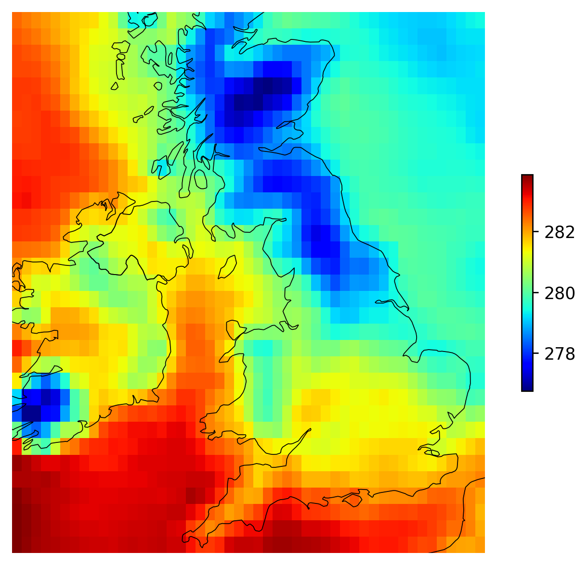

mapflow
=======

``mapflow`` transforms 3D ``xr.DataArray`` in video files in one code line. It relies on ``matplotlib`` and ``ffmpeg``. If you're not installing ``mapflow`` from conda-forge, make sure ``ffmpeg`` is installed on your system.

Installation
------------

.. code-block:: bash

   pip install mapflow

Or:

.. code-block:: bash

   conda install -c conda-forge -y mapflow

Simple usage
------------

.. code-block:: python

   import xarray as xr
   from mapflow import animate

   ds = xr.tutorial.open_dataset("era5-2mt-2019-03-uk.grib")
   animate(da=ds['t2m'].isel(time=slice(120)), path='animation.mp4')

.. raw:: html

    <video width="640" height="480" controls>
      <source src="./_static/animation.mp4" type="video/mp4">
    </video>

Static plot
-----------

``mapflow``'s function ``plot_da`` can be used as a quick and easy function to plot a 2D ``xr.DataArray``
with the world's geographic boundaries.

.. code-block:: python

   import xarray as xr
   from mapflow import plot_da

   ds = xr.tutorial.open_dataset("era5-2mt-2019-03-uk.grib")
   plot_da(da=ds['t2m'].isel(time=0))

.. toctree::
   :maxdepth: 2
   :caption: Contents:

   api
